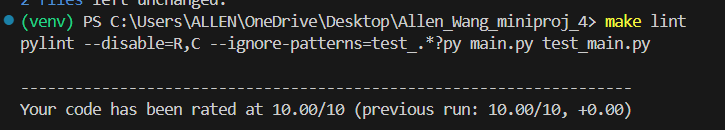
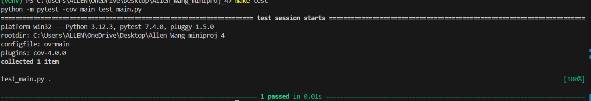
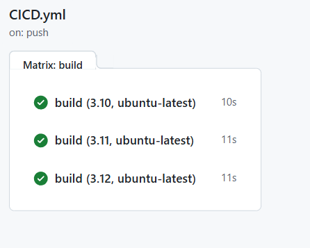

# Allen_Wang_miniproj_4

[](https://GitHub.com/nogibjj/Allen_Wang_miniproj_4/actions/workflows/CICD.yml)

## Overview

This project includes a Python development environment configured with a `.devcontainer`, a `Makefile` for managing setup, testing, and linting tasks, and a functioning CI/CD pipeline. The project is designed to test the functionality of Python code across multiple Python versions using GitHub Actions. It includes a simple function to print a string in reverse.

## Project Structure

- **.devcontainer/**: Contains configuration for a development container to ensure consistency, portability, and isolation. Includes:
  - `devcontainer.json`: Configuration file for the development container.
  - `Dockerfile`: Defines the container image for the development environment.

- **Makefile**: Provides commands for setup, testing, and linting:
  - `make install`: Installs project dependencies.
  - `make format`: Formats all Python files in the current directory using Black
  - `make lint`: Lints all Python files (excluding test files) using Pylint.
  - `make test`: Runs tests.
  - `make all`: Runs all the tasks in sequence.

- **.GitHub/workflows/ci.yml**: Configures GitHub CI/CD pipeline to automatically run setup, linting, and tests across multiple Python versions (3.10, 3.11, 3.12) using a matrix build.

- **main.py**: Contains a function that prints a string in reverse.

- **README.md**: This file, providing setup and usage instructions.

## Setup

1. **Clone the repository:**

    ```bash
    git clone https://GitHub.com/nogibjj/Allen_Wang_miniproj_4.git
    cd Allen_Wang_miniproj_4
    ```

2. **Install dependencies:**

    ```bash
    make install
    ```

3. **Format code:**

    ```bash
    make format
    ```
    
4. **Lint code:**

    ```bash
    make lint
    ```
   
5. **Test code:**

    ```bash
    make test
    ```
   

### GitLab Actions Matrix Configuration
   
